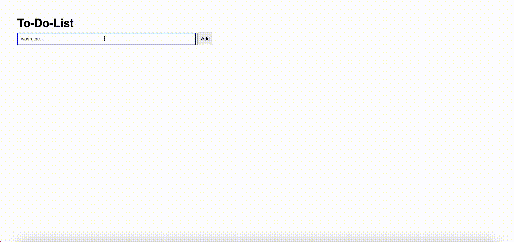

# Basit To-Do-App
Bu proje, HTML, CSS ve JavaScript kullanılarak geliştirilmiş bir To-Do (Yapılacaklar Listesi) uygulamasıdır. Kullanıcılar görev ekleyebilir, tamamlanan görevleri işaretleyebilir ve görevleri silebilirler.

## Özellikler

- Görev ekleme
- Görev silme
- Görevi tamamlanmış olarak işaretleme

### Teknolojiler
- HTML
- CSS
- JavaScript

### GIF

